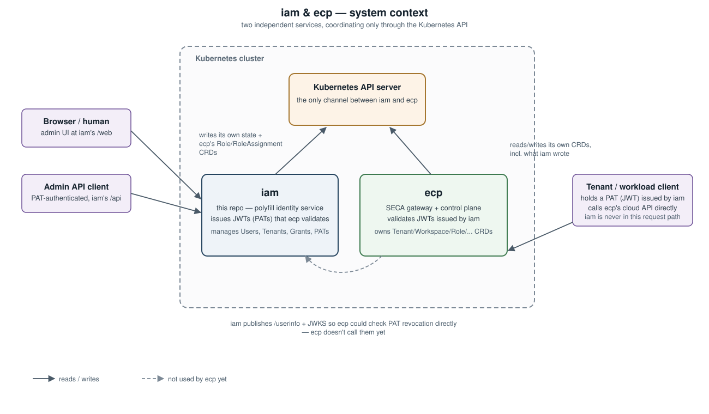
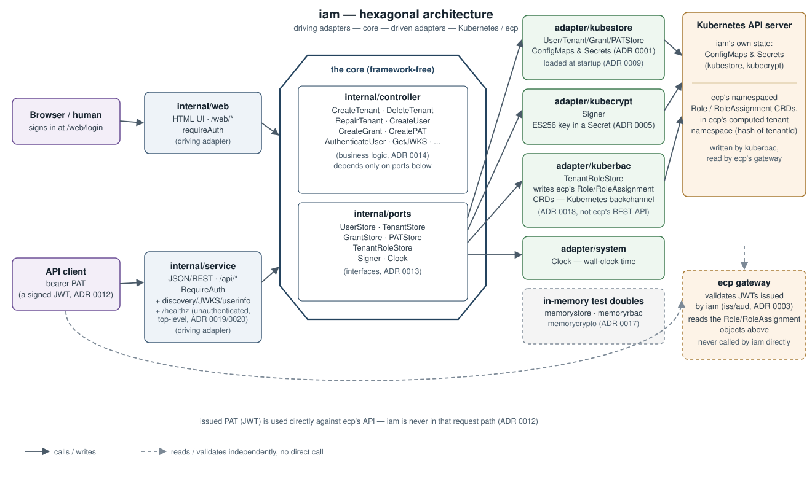

# iam

A small, self-contained identity service for [SECA](https://github.com/eu-sovereign-cloud)
deployments that have no CSP-provided identity provider to lean on
(IONOS's self-installable model). It's a *polyfill*: it exists to issue
JWTs the [ecp](https://github.com/eu-sovereign-cloud/ecp) gateway already
knows how to validate, so ecp needs no code changes to work with it. See
[GitHub issue #1](https://github.com/eu-sovereign-cloud/iam/issues/1) for
the full ask, and `doc/adr/` for the architecture decisions behind this
implementation.

It manages **Users**, **Tenants**, and **Grants** (which tenants a user may
claim, and what ecp role(s) they hold there), and lets a user create/revoke
their own **Personal Access Tokens (PATs)** — which *are* signed JWTs, not a
separate credential exchanged for one (see ADR 0012). Only global admins
manage Tenants/Users/Grants; any user manages their own PATs. A Grant can
also mark its subject as a **tenant admin**
(`PATCH /api/v1/users/{subject}/grants/{tenantId}`, global-admin-only),
letting them manage grants for that one tenant without being a global
admin (see ADR 0016).

Creating a Tenant or Grant also provisions the corresponding `Role`/
`RoleAssignment` objects directly in ecp's Kubernetes cluster (a
backchannel, not ecp's REST API — see ADR 0018); an admin-only
`POST /api/v1/tenants/{tenantId}/repair` re-applies that RBAC state from
IAM's own records, overwriting any drift. iam also exposes OIDC discovery,
JWKS, and a `/userinfo` endpoint (see ADR 0019, issue #2) so a verifier
can validate IAM-issued JWTs fully offline and still catch a PAT revoked
after issuance — though nothing in ecp calls these yet today (see ADR
0019's Context). Full IdP/SSO is otherwise out of scope.

## Architecture



iam and ecp are separate services in the same Kubernetes cluster and
coordinate through the Kubernetes API: iam writes its own state plus
ecp's `Role`/`RoleAssignment` CRDs as a backchannel (ADR 0018), and ecp
independently reads/writes its own resources and validates the JWTs iam
issues. iam also publishes OIDC discovery, JWKS, and `/userinfo`
endpoints (ADR 0019) so ecp *could* call it directly to check PAT
revocation status — ecp doesn't do that yet (see ADR 0019's Context).



Zooming into iam itself, it follows a hexagonal layout (ADR 0002): two driving adapters,
`internal/web` (a server-rendered HTML UI) and `internal/service` (the
JSON/REST API), both sit behind a `RequireAuth` check and call into
`internal/controller` — the framework-free core holding all business
logic (ADR 0014). The core depends only on the interfaces in
`internal/ports`, which production adapters under `internal/adapter/*`
implement against Kubernetes: `kubestore` and `kubecrypt` for iam's own
state (ConfigMaps/Secrets), and `kuberbac`, which writes ecp's
`Role`/`RoleAssignment` CRDs straight into the cluster as a backchannel
(ADR 0018) — ecp itself never sees a call from iam, it just reads what
`kuberbac` wrote and validates the JWTs iam issues. Tests swap in the
in-memory doubles under `internal/adapter/{memorystore,memoryrbac,
memorycrypto}` instead (ADR 0017). See `doc/adr/` for the full decision
log behind every piece of this.

## Configuration

All configuration is via environment variables (`internal/config`):

| Variable                 | Default        | Notes                                   |
|---------------------------|----------------|------------------------------------------|
| `IAM_LISTEN_ADDR`          | `:8080`        |                                            |
| `IAM_NAMESPACE`            | `iam-system`   | Kubernetes namespace IAM stores state in  |
| `IAM_JWT_ISSUER`           | *(required)*   | `iss` claim on issued JWTs                |
| `IAM_JWT_AUDIENCE`         | *(empty)*      | `aud` claim, comma-separated, omitted if unset |
| `KUBECONFIG`               | *(empty)*      | path to a kubeconfig; empty = in-cluster  |
| `IAM_LOG_LEVEL`            | `info`         |                                            |

## Running locally

Against a local cluster (e.g. `kind create cluster`):

```sh
export IAM_JWT_ISSUER=https://iam.example.com
export IAM_JWT_AUDIENCE=ecp-gateway
export KUBECONFIG=~/.kube/config
make run
```

On first startup, iamd creates an admin User and a bootstrap PAT, logging
the raw PAT once:

```
{"level":"WARN","msg":"created bootstrap admin PAT - copy it now, it will not be shown again","subject":"admin","pat":"iampat_..."}
```

### Example flow

```sh
ADMIN_PAT=iampat_...   # from the log line above

# Create a tenant
curl -s -X POST localhost:8080/api/v1/tenants \
  -H "Authorization: Bearer $ADMIN_PAT" \
  -d '{"tenantId":"tenant-1","displayName":"Tenant One"}'

# Create a non-admin user and grant it that tenant
curl -s -X POST localhost:8080/api/v1/users \
  -H "Authorization: Bearer $ADMIN_PAT" \
  -d '{"subject":"alice@example.com","displayName":"Alice"}'
curl -s -X POST localhost:8080/api/v1/users/alice@example.com/grants \
  -H "Authorization: Bearer $ADMIN_PAT" \
  -d '{"tenantId":"tenant-1","roles":["member"]}'

# Create a PAT for that user (self-service; here done with the admin PAT on their behalf).
# The "secret" returned is a signed JWT and IS the bearer credential — use
# it directly, there is no separate exchange step (ADR 0012).
curl -s -X POST localhost:8080/api/v1/users/alice@example.com/pats \
  -H "Authorization: Bearer $ADMIN_PAT" \
  -d '{"name":"laptop"}'
# => {"id":"...","subject":"alice@example.com",...,"secret":"eyJhbGci..."}
```

Decode the `secret` (a standard JWT) to see the claims shape the ecp
gateway expects (`sub`, `iss`, `aud`, `exp`, `tenants`, optional `scope`).

A minimal web UI is also available at `/web/login` (paste a PAT to sign in).

### OIDC discovery, JWKS, and `/userinfo`

These three are public and unauthenticated except `/userinfo`, which
authenticates via the PAT being checked (see ADR 0019):

```sh
curl -s localhost:8080/.well-known/openid-configuration
curl -s localhost:8080/.well-known/jwks.json

# Confirms a PAT is still live — the one thing offline JWT verification
# alone can't see (issue #2). Uses the PAT minted above.
PAT=eyJhbGci...
curl -s -H "Authorization: Bearer $PAT" localhost:8080/userinfo
# => {"sub":"alice@example.com"}
```

## Development

```sh
make build   # compile ./bin/iamd
make test    # go test ./... -race
make lint    # golangci-lint run
make fmt     # gofmt + goimports
make docker-build
```
